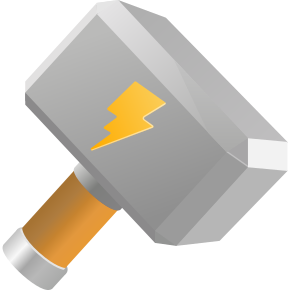
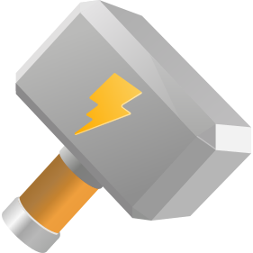
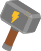
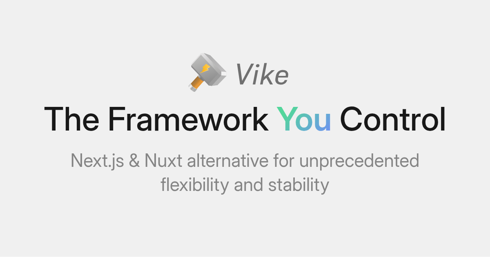

# Vike old assets

### Standard

The standard Vike icon.

**logo/vike.svg**

> [!NOTE]
> See this repository's files for variants for different contexts (padding, circle crop, etc.).

### Very small

Use the following to display Vike's logo at a very small size. (It has reduced handle length and increased contrast.)

**logo/favicon/vike-favicon.svg**

### Old logo

**logo/old/vike-oblique.svg**

> [!NOTE]
> See also the [old logo editor](https://land.vike.dev/editor).

 

## Banner

**banner/banner.png**

